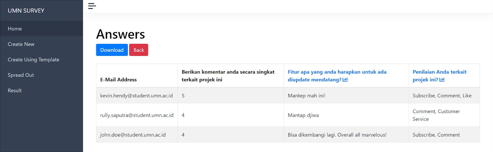
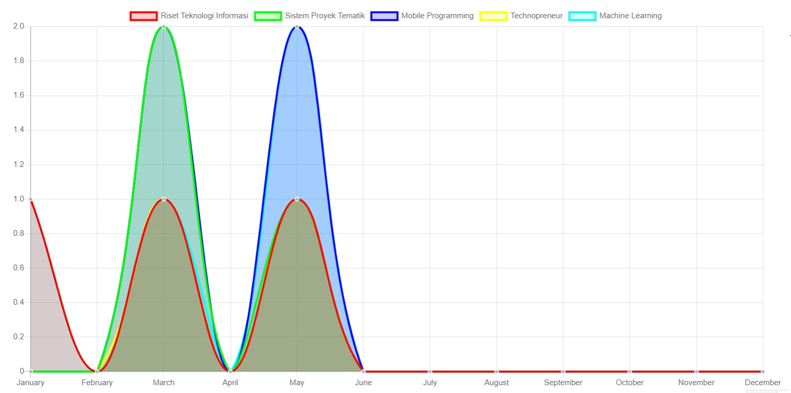

## UMN Survey
Survey website about campus facilities and services built using Yii and Oracle.

## Features
User Dashboard
* Show a survey to fill
* Show selected survey results in graphs

Admin Dashboard
* Manage surveys have been made
* Create new surveys from scratch or template
* Spread out surveys to selected parties through e-mail
* Open or close surveys
* Show survey results in graphs and trends of the same surveys by time
* Show and download survey answers

## Demo
 

  

 

 

  

 

 

  

 

 

  

 

 

  

 

 

  

 

 

  

 

 

  

 

 

  

 

 

  

 

## Contributors
* Benny Richardson
* Kevin Hendy
* Wilson Philips
